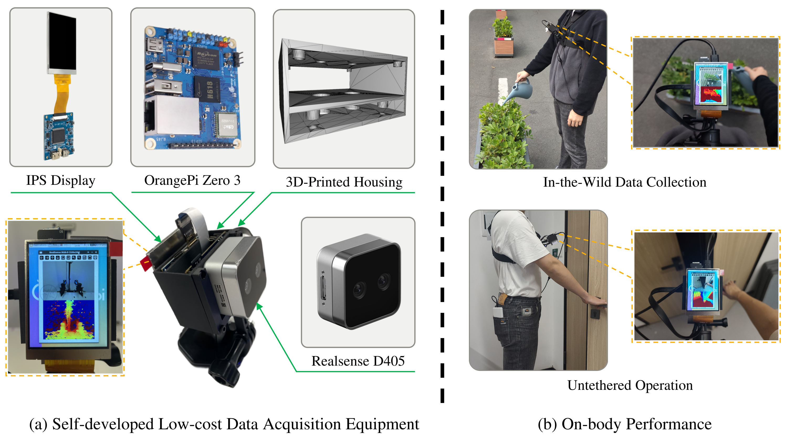

# Hand2Gripper: Self-developed Open-Source Data Acquisition Hardware Guide

[Hardware] official implementation of the paper "Hand2Gripper: A Low-Cost Data Generation Framework for Imitation Learning with the Adaptive Hand-Gripper Mapping Model".

To overcome the constraints of scene-limited fixed cameras and costly teleoperation systems in robot data acquisition, we designed a lightweight (< 300g), comfortably wearable chest-mounted RGB-D device. With a total cost under $300, this hardware unlocks unconstrained motion capture across diverse indoor and outdoor scenarios, laying the physical foundation for generalizable robot policy learning.

## 🛒 Bill of Materials (BOM)

Our system breaks the cost barriers of conventional setups, costing merely 1% of conventional teleoperation systems.

| Part | Quantity | Link | Price (per unit) |
| --- | --- | --- | --- |
| **Vision & Compute** |  |  |  |
| Intel RealSense D405 RGB-D Camera | 1 | [www.taobao.com](https://shop36983089.taobao.com/shop/view_shop.htm?appUid=RAzN8HAbf9oQudzT2tMxNgfgd7QMS&spm=a21n57.1.hoverItem.3) | $250 |
| OrangePi Zero 3 Kit | 1 | [www.taobao.com](https://shop225003950.taobao.com/shop/view_shop.htm?appUid=RAzN8HWUhDnXiYDxxA1fWADDeLNQemZCyuzxmzrpqhGDMHsQ832&spm=a21n57.1.hoverItem.1) | $35 |
| IPS Display | 1 | [www.taobao.com](https://item.taobao.com/item.htm?id=750322436607&mi_id=0000KmJ4YzeNyGoqKiiRgn2HOB0oF_FEywou9R8XqhaZLgQ&spm=tbpc.boughtlist.suborder_itempic.d750322436607.77a02e8dEObXH8) | $10 |
| **Wearable & Power** |  |  |  |
| Adjustable Chest-Mount Strap | 1 | [www.taobao.com](【https://detail.tmall.com/item.htm?id=772227783284&mi_id=0000r9YtiLMlJqTohUwr26vlFB1A716iS3umtkT5QwQfjPA&spm=tbpc.boughtlist.suborder_itemtitle.1.77a02e8dEObXH8&skuId=5289863313480】) | $8 |
| 5V Power | 1 |  |  |
| **Fasteners & Consumables** |  |  |  |
| PLA Filament (1kg) | 0.5 | [www.taobao.com](https://detail.tmall.com/item.htm?abbucket=15&id=693972799714&mi_id=0000EVLNwlWFXihX8AAuLN2avS97h1zxjOjz6LfzJEjTpfU&ns=1&priceTId=2147837b17726784527384164e1c8d&skuId=5559267372026&spm=a21n57.1.hoverItem.2&utparam=%7B%22aplus_abtest%22%3A%22a48c2ce2db76c157bb6022205fca2c06%22%7D&xxc=taobaoSearch) | $4 |
| USB Cable (Type-C) | 2 |  |  |
| M3 Screws & Nuts | 10 |  |  |
| **Total** |  |  | **< $310** |

## 🛠️ CAD Models

All structural components are body-adaptive and easily 3D printed.

* **3D Printed PLA Housing (STL):** [housing.stl](asset/housing.stl)
* **3D Printed PLA Support (STL):** [support.stl](asset/support.stl)

## 🖨️ 3D Printing Instructions

The custom housing uses standard PLA to keep the total weight below 300g.

**Common Print Parameters (PLA):**

* **Layer height:** 0.1mm
* **Infill:** 20% Gyroid
* **Supports:** Yes

---

## 🔧 Step-by-Step Assembly Guide

Follow these illustrated steps to build your data acquisition device.

### Step 1: Prepare the 3D Printed Housing

Remove all support materials from the 3D-printed PLA housing. Ensure the mounting holes for the D405 and OrangePi are clean.

### Step 2: Mount the Intel RealSense D405

Insert the D405 camera into the front compartment of the housing.

### Step 3: Install the OrangePi Zero 3 & IPS Display

Place the OrangePi Zero 3 into the rear bracket. Attach the IPS display to the top mount. Carefully connect the display ribbon cable to the OrangePi.

### Step 4: Wiring and Connection

Connect the RealSense D405 to the OrangePi. Ensure cables are neatly tucked to avoid interference during motion capture.

### Step 5: Wearable Setup & Power

Attach the 3D-printed body-adaptive brackets to the adjustable chest strap. Connect your 5V portable charger to the OrangePi.

---

## 💿 System Image

To save time compiling drivers and configuring the environment, we provide a pre-configured OrangePi OS image ready for data collection.

* **System Image Download:** [Orange Pi Zero3 Image](http://www.orangepi.cn/html/hardWare/computerAndMicrocontrollers/service-and-support/Orange-Pi-Zero-3.html)

**Quick Setup:**

1. Download the `.img` file from the link above.
2. Use a tool like [balenaEtcher](https://balena.io/etcher/) or [Rufus](https://rufus.ie/) to flash the image onto your Micro SD card.
3. Insert the SD card into the OrangePi Zero 3, power it on via the 5V portable charger, and the system will automatically boot into the data acquisition environment.